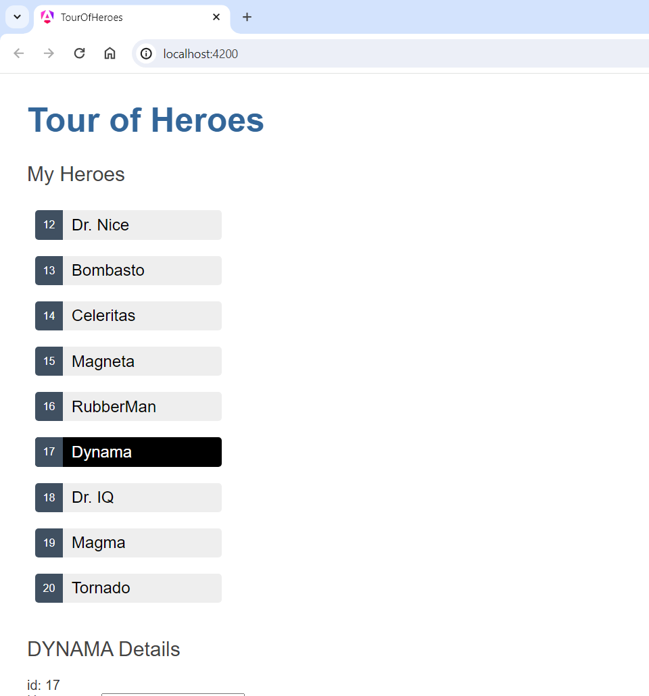

# Tour Of Heroes

The Tour of Heroes application that you build helps a staffing agency manage its stable of heroes. The application has many of the features that you'd expect to find in any data-driven application.

The finished application:
 - Gets a list of heroes
 - Displays the heroes in a list
 - Edits a selected hero's details
 - Navigates between different views of heroic data

## Features

Angular features used in this application:

 - Use Angular directives to show and hide elements and display lists of hero data.
 - Create Angular components to display hero details and show an array of heroes.
 - Use one-way data binding for read-only data.
 - Add editable fields to update a model with two-way data binding.
 - Bind component methods to user events, like keystrokes and clicks.
 - Enable users to select a hero from a list and edit that hero in the details view.
 - Format data with pipes.
 - Create a shared service to assemble the heroes.
 - Use routing to navigate among different views and their components.

## Presentation

| My Heroes                                    | Details & Messages                           | 
|----------------------------------------------|----------------------------------------------|
|  |  |
